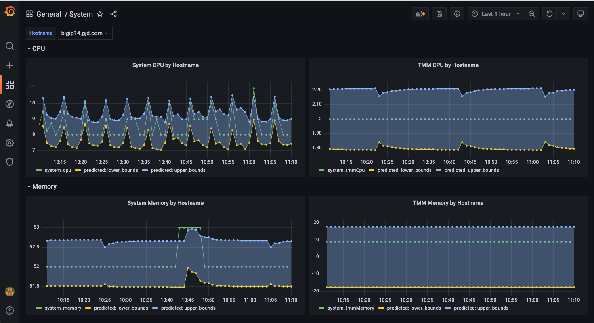

# Telemetry Streaming to TimescaleDB Quick-Start

[F5 Telemetry Streaming](https://clouddocs.f5.com/products/extensions/f5-telemetry-streaming/latest/) is an extension to the BIG-IP platform, which collects, normalizes and forwards metrics and/or logs to a user-specified telemetry consumer. Getting started with Telemetry Streaming typically requires configuring a 3rd party consumer (such as ElasticSearch, or AWS CloudWatch) to receive the telemetry data.

In order for users to get started with F5 Telemetry Streaming more quickly, this "Telemety Streaming to TimescaleDB" QuickStart deploys a complete "quick start" environment into any Kubernetes cluster, using the included Helm chart.

The quick start environment contains all of the components required to:
1) receive telemetry data from F5 Telemetry Streaming (via an OpenTelemetry Collector)
2) store that telemetry data in long-term storage (via the PromScale extension which stores data in TimescaleDB)
3) visualize the telemetry data (via dashboards in Grafana)
4) build forecasts on historic time series telemetry data, and visualize those forecasts against the actual values (via the Telemetry-Models project, and visualized in Grafana)

# Getting started

## Prerequisites
* an F5 BIG-IP (with F5 Telemetry Streaming installed on it)
    * Instructions for installing F5 Telemetry Streaming are available here: https://clouddocs.f5.com/products/extensions/f5-telemetry-streaming/latest/quick-start.html
* an available Kubernetes cluster, with access to that cluster
    * This can be a local cluster, or a cluster in a cloud provider
* Helm
    * Instructions for installing Helm are available here: https://helm.sh/docs/intro/install/

## Deploying the quickstart environment
From the commandline, run the following commands:
```
> helm repo add ts https://garrettdieckmann.github.io/telemetry-streaming-to-timescaledb
> export TIMESCALE_PASSWORD=...
> export GRAFANA_PASSWORD=...
> helm install ts/telemetry-streaming-quickstart \
    --generate-name \
    --set timescaledb.password=$TIMESCALE_PASSWORD \
    --set grafana.adminPassword=$GRAFANA_PASSWORD
NAME: telemetry-streaming-quickstart-1639170830
LAST DEPLOYED: Fri Dec 10 13:13:52 2021
NAMESPACE: default
STATUS: deployed
REVISION: 1
TEST SUITE: None
NOTES:
OpenTelemetry Metrics can now be sent to:
export OTEL_COLLECTOR_IP=$(kubectl get nodes --namespace telemetry-streaming-quickstart -o jsonpath="{.items[0].status.addresses[0].address}")
export OTEL_COLLECTOR_PORT=$(kubectl get --namespace telemetry-streaming-quickstart -o jsonpath="{.spec.ports[0].nodePort}" services otel-collector-ingest-svc)


echo http://$OTEL_COLLECTOR_IP:$OTEL_COLLECTOR_PORT

A fully configured Grafana dashboard should now be accessible at:
export GRAFANA_IP=$(kubectl get nodes --namespace telemetry-streaming-quickstart -o jsonpath="{.items[0].status.addresses[0].address}")
export GRAFANA_PORT=$(kubectl get --namespace telemetry-streaming-quickstart -o jsonpath="{.spec.ports[0].nodePort}" services grafana-external-svc)

echo http://$GRAFANA_IP:$GRAFANA_PORT
```

As noted in the Helm install output, two Kubernetes services will be exposed as NodePorts:
1) one for the OpenTelemetry Collector @ `http://$OTEL_COLLECTOR_IP:$OTEL_COLLECTOR_PORT`
2) one for Grafana @ `http://$GRAFANA_IP:$GRAFANA_PORT`

### Deploying in a Cloud Provider
The Telemetry Streaming Quick Start Helm chart can also be deployed into a cloud provider's managed Kubernetes service. The example below shows how the quick start can be deployed into [DigitalOcean's Managed Kubernetes Service](https://www.digitalocean.com/products/kubernetes/). Using a cloud provider also allows for the quick start to use a Cloud LoadBalancer as the Kubernetes Service type.
1. Create (if one hasn't already been created) a managed Kubernetes cluster in DigitalOcean. This will provision a small cluster (1 node, with 2 vCPUs and 2GB of RAM) that will be sufficient for this quickstart.
```
> doctl kubernetes cluster create telemetry-streaming-quickstart --count 1 --size s-2vcpu-2gb
Notice: Cluster is provisioning, waiting for cluster to be running
....
```
2. Deploy the Helm chart into the DigitalOcean cluster, and requesting 2 Load Balancers to be provisioned (1 for the Grafana dashboard, and 1 for the OpenTelemetry Collector's receiver)
```
TODO
```

### Sending Telemetry to the Quick Start environment
Any this point, any OpenTelemetry metrics can be sent to the OpenTelemetry Collector. To configure F5 Telemetry Streaming to send telemetry data, via the OpenTelemetry Line Protocol, to the OpenTelemetry Collector, submit the following declaration to F5 Telemetry Streaming:
```
{
    "class": "Telemetry",
    "My_System": {
        "class": "Telemetry_System",
        "enable": true,
        "systemPoller": {
            "interval": 60
        }
    },
    "OpenTelemetry_Consumer": {
        "class": "Telemetry_Consumer",
        "type": "OpenTelemetry_Exporter",
        "host": {{OTEL_COLLECTOR_IP}},
        "port": {{OTEL_COLLECTOR_PORT}},
        "metricsPath": "/v1/metrics"
    }
}
```

# Visualizing the F5 Telemetry Streaming data
The quick start environment includes pre-built dashboards, and graphs that visualize the metrics received from F5 Telemetry Streaming.
The Grafana system can be accessed by navigating to `http://$GRAFANA_IP:$GRAFANA_PORT` (default username is `admin`, and password is the value passed into `grafana.adminPassword` )

The following dashboards and dashboard panels are pre-built in Grafana, using the following F5 Telemetry Streaming OpenTelemetry metrics:
| Dashboard      | Row | Panel | Metric |
| ----------- | ----------- | ----------- | ----------- |
| System      | CPU | System CPU by Hostname       | system_cpu |
| System      | CPU | TMM CPU by Hostname       | system_tmmCpu |
| System      | Memory | System Memory by Hostname       | system_memory |
| System      | Memory | TMM Memory by Hostname       | system_tmmMemory |
| Virtuals      | Bits In/Out | Bits In by Virtual Server Name | virtualServers_clientside_bitsIn |
| Virtuals      | Bits In/Out | Bits Out by Virtual Server Name | virtualServers_clientside_bitsOut |

## TimeSeries forecasting
**Note:** The Telemetry-Models CronJob runs every 20 minutes, on the hour; Forecasted data will be available after the first execution of the Telemetry-Models CronJob.

The Grafana dashboards will also graph forecasted or predicted metric values, given the historic values for those metrics. The graphs will overlay both an "upper forecasted value" (upper_bounds) and "lower forecasted value" (lower_bounds) over the actual metric value, which can be used to determine if the actual metrics are out-of-bounds of the forecast.

